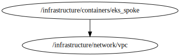

<!-- BEGIN_TF_DOCS -->


# Stack eks\_spoke
This file creates a eks\_spoke based on **terraform-aws-modules/eks/aws**

## Source Module info
- **version**: = "20.33.1"
- **Link**: [terraform-aws-modules/eks/aws](https://registry.terraform.io/modules/terraform-aws-modules/eks/aws/20.33.1)

## Code Dependencies Graph
<center>

   

  ##### **Dependency Graph**

</center>

---

## Example parameter options for each environment

```hcl
#eks_control_plane-terragrunt.hcl
include "root" {
  path = find_in_parent_folders("root.hcl")
  expose = true
}
dependency "vpc" {
  config_path  = "${get_parent_terragrunt_dir("root")}/infrastructure/network/vpc"
  mock_outputs = {
    vpc_id         = "vpc-04e3e1e302f8c8f06"
    public_subnets = [
      "subnet-0e4c5aedfc2101502",
      "subnet-0d5061f70b69eda14",
    ]
     private_subnets                             = [
     "subnet-0e4c5aedfc2101502",
      "subnet-0d5061f70b69eda14",
      "subnet-0d5061f70b69eda15",
     ]
  }
  mock_outputs_merge_strategy_with_state = "shallow"
}

locals {
  # Define parameters for each workspace
  env = {
    default = {
      create       = false
      cluster_name = "${include.root.locals.common_vars.locals.project}-${include.root.locals.environment.locals.workspace}-spoke"
      cluster_version = "1.32"

      # Optional
      cluster_endpoint_public_access = true

      # Optional: Adds the current caller identity as an administrator via cluster access entry
      enable_cluster_creator_admin_permissions = true

      cluster_compute_config = {
        enabled = true
        node_pools = ["general-purpose"]
      }

      tags = {
        Environment = "dev"
        Layer       = "Networking"
      }
    }
    "dev" = {

      create = true
    }
    "prod" = {

      create = true
    }
  }
  # Merge parameters
  environment_vars = contains(keys(local.env), include.root.locals.environment.locals.workspace) ?  include.root.locals.environment.locals.workspace : "default"
  workspace = merge(local.env["default"], local.env[local.environment_vars])
}


terraform {
  source = "tfr:///terraform-aws-modules/eks/aws?version=20.33.1"

}

inputs = {
  create= local.workspace["create"]
  cluster_name = local.workspace["cluster_name"]
  cluster_version = local.workspace["cluster_version"]

  # Optional
  cluster_endpoint_public_access = local.workspace["cluster_endpoint_public_access"]

  # Optional: Adds the current caller identity as an administrator via cluster access entry
  enable_cluster_creator_admin_permissions = local.workspace["enable_cluster_creator_admin_permissions"]

  cluster_compute_config = local.workspace["cluster_compute_config"]

  vpc_id = dependency.vpc.outputs.vpc_id
  subnet_ids = dependency.vpc.outputs.private_subnets

  tags = {
    Environment = include.root.locals.environment.locals.workspace
    Terraform   = "true"
  }

  tags = local.workspace["tags"]

}
```
<!-- END_TF_DOCS -->