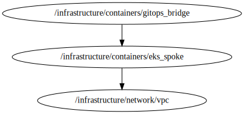

<!-- BEGIN_TF_DOCS -->


# Stack gitops\_bridge
This file creates a gitops\_bridge based on **../../../modules/terraform-aws-gitops-bridge-spoke**

## Source Module info
- **version**: = "latest"
- **Link**: [../../../modules/terraform-aws-gitops-bridge-spoke](github.com/../../../modules/terraform-aws-gitops-bridge-spoke)

## Code Dependencies Graph
<center>

   

  ##### **Dependency Graph**

</center>

---

## Example parameter options for each environment

```hcl
#eks_control_plane-terragrunt.hcl
include "root" {
  path = find_in_parent_folders("root.hcl")
  expose = true
}

include "k8s_helm_provider" {
  path = find_in_parent_folders("/common/additional_providers/provider_k8s_hub.hcl")
}

dependency "eks" {
  config_path = "${get_parent_terragrunt_dir("root")}/infrastructure/containers/eks_spoke"
  mock_outputs = {
    cluster_name = "dummy-cluster-name"
    cluster_endpoint = "dummy_cluster_endpoint"
    cluster_certificate_authority_data = "dummy_cluster_certificate_authority_data"
    cluster_version = "1.31"
    cluster_platform_version = "1.31"
    oidc_provider_arn =  "dummy_arn"
  }
  mock_outputs_merge_strategy_with_state = "shallow"
}
locals {
  # Define parameters for each workspace
  env = {
    default = {

      environment  = "control-plane"
      oss_addons = {
        enable_argo_workflows = true
        #enable_foo            = true
        # you can add any addon here, make sure to update the gitops repo with the corresponding application set
      }

      addons_metadata = merge(
        {
          addons_repo_url      = "https://github.com/gitops-bridge-dev/gitops-bridge-argocd-control-plane-template"
          addons_repo_basepath = ""
          addons_repo_path     ="bootstrap/control-plane/addons"
          addons_repo_revision = "HEAD"
        }
      )


      tags = {
        Environment = "control-plane"
        Layer       = "Networking"
      }
    }
    "dev" = {

      create = true
    }
    "prod" = {

      create = true
    }
  }
  # Merge parameters
  environment_vars = contains(keys(local.env), include.root.locals.environment.locals.workspace) ? include.root.locals.environment.locals.workspace : "default"
  workspace = merge(local.env["default"], local.env[local.environment_vars])
}


terraform {
  source = "../../../modules/terraform-aws-gitops-bridge-spoke"

}

inputs = {
  cluster_name                       = dependency.eks.outputs.cluster_name
  cluster_endpoint                   = dependency.eks.outputs.cluster_endpoint
  cluster_platform_version           = dependency.eks.outputs.cluster_platform_version
  oidc_provider_arn                  = dependency.eks.outputs.oidc_provider_arn
  cluster_certificate_authority_data = dependency.eks.outputs.cluster_certificate_authority_data
  create_kubernetes_resources = false
  cluster = {
    cluster_name =   dependency.eks.outputs.cluster_name
    environment  = local.workspace["environment"]
    metadata     = local.workspace["addons_metadata"]
    addons = merge(local.workspace["oss_addons"], { kubernetes_version = dependency.eks.outputs.cluster_version })

  }
  hub_account_id =  include.root.locals.common_vars.locals.hub_account_id

  tags = local.workspace["tags"]

}
```
<!-- END_TF_DOCS -->